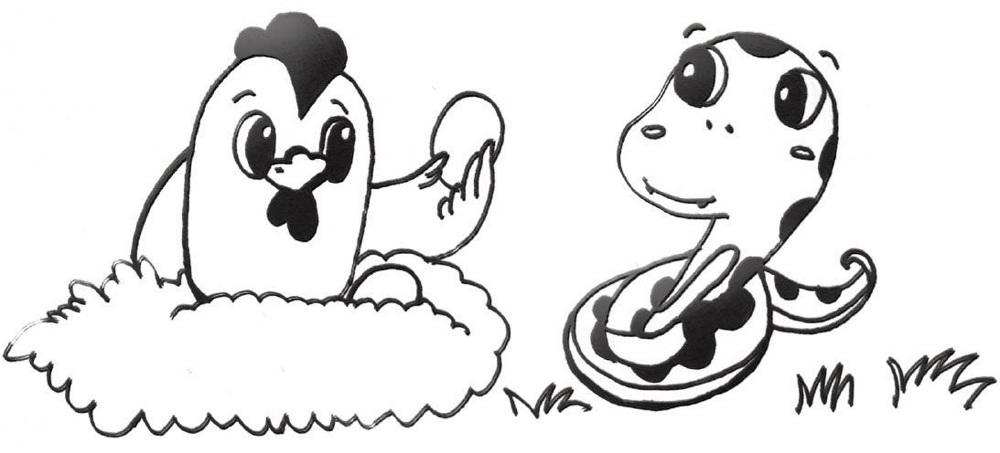

# 4.2 继承者们

### 1．子类

类别本身还可以进一步细分成子类。比如说，鸟类可以进一步分成鸡、天鹅。在面向对象编程中，我们通过**继承**（Inheritance）来表达上述概念。

------------------------------------------------------------------------

    class Bird(object):
        feather          = True
        reproduction  = "egg"
        def chirp(self, sound):
            print(sound)

    class Chicken(Bird):
        how_to_move= "walk"
        edible     = True

    class Swan(Bird):
        how_to_move= "swim"
        edible     = False

    summer = Chicken()
    print(summer.feather)                        # 打印True
    summer.chirp("ji")                           # 打印'ji'

------------------------------------------------------------------------

新定义的鸡（Chicken）类，增加了两个属性：移动方式（how\_to\_move）和可以食用（edible）

在类定义时，括号里为Bird。这说明，鸡类是属于鸟类（Bird）的一个子类，即Chicken继承自Bird。自然而然，鸟类就是鸡类的父类。Chicken将享有Bird的所有属性。尽管我们只声明了summer是鸡类，但它通过继承享有了父类的属性，比如数据性的属性feather，还有方法性的属性chirp()。新定义的天鹅（Swan）类，同样继承自鸟类。在创建一个天鹅对象时，该对象自动拥有鸟类的属性。

图4-1　一个鸡类的对象

很明显，我们可以通过继承来减少程序中的重复信息和重复语句。如果我们分别定义鸡类和天鹅类，而不是继承自鸟类，就必须把鸟类的属性分别输入到鸡类和天鹅类的定义中。整个过程会变得烦琐，因此，继承提高了程序的可重复使用性。最基础的情况，是类定义的括号中是object。类object其实是Python中的一个内置类。它充当了所有类的祖先。

分类往往是人了解世界的第一步。我们将各种各样的东西分类，从而了解世界。从人类祖先开始，我们就在分类。18世纪是航海大发现的时代，欧洲航海家前往世界各地，带回来闻所未闻的动植物标本。人们激动于大量出现的新物种，但也头痛于如何分类。卡尔·林奈提出一个分类系统，通过父类和子类的隶属关系，为进一步的科学发现铺平了道路。面向对象语言及其继承机制，正是模拟人的有意识分类过程。

### 2．属性覆盖

如上所述，在继承的过程中，我们可以在子类中增加父类不存在的属性，从而增强子类的功能。此外，我们还可以在子类中替换父类已经存在了的属性，比如：

------------------------------------------------------------------------

    class Bird(object):
        def chirp(self):
            print("make sound")

    class Chicken(Bird):
        def chirp(self):
            print("ji")

    bird    = Bird()
    bird.chirp()       # 打印'make sound'

    summer = Chicken()
    summer.chirp()     # 打印'make sound'和'ji'

------------------------------------------------------------------------

鸡类（Chicken）是鸟类（Bird）的子类。在鸡类（Chicken）中，我们定义了方法chirp()。这个方法在鸟类中也有定义。通过调用可以看出，鸡类会调用自身定义的
chirp()方法，而不是父类中的chirp()方法。从效果上看，这就好像父类中的方法chirp()被子类中的同名属性**覆盖**（override）了一样。

通过对方法的覆盖，我们可以彻底地改变子类的行为。但有的时候，子类的行为是父类行为的拓展。这时，我们可以通过super关键字在子类中调用父类中被覆盖的方法，比如：

------------------------------------------------------------------------

    class Bird(object):
        def chirp(self):
            print("make sound")

    class Chicken(Bird):
        def chirp(self):
            super().chirp()
            print("ji")

    bird    = Bird()
    bird.chirp()       # 打印"make sound"

    summer = Chicken()
    summer.chirp()     # 打印"make sound"和"ji"

------------------------------------------------------------------------

在鸡类的chirp()方法中，我们使用了super。它是一个内置类，能产生一个指代父类的对象。通过super，我们在子类的同名方法中调用了父类的方法。这样，子类的方法既能执行父类中的相关操作，又能定义属于自己的额外操作。

调用super的语句可以出现在子类方法的第一句，也可以出现在子类方法的任意其他位置。
