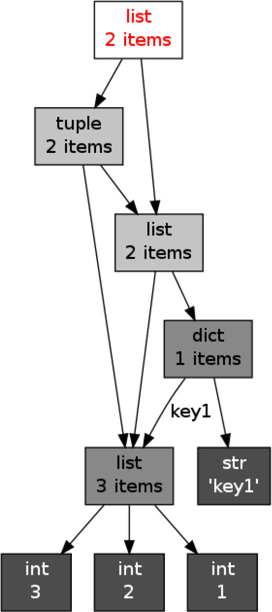
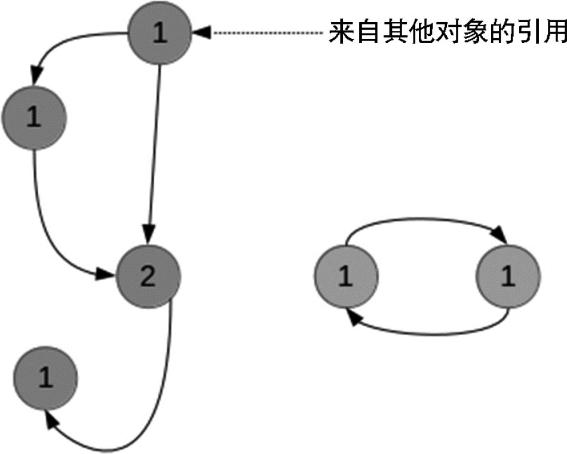
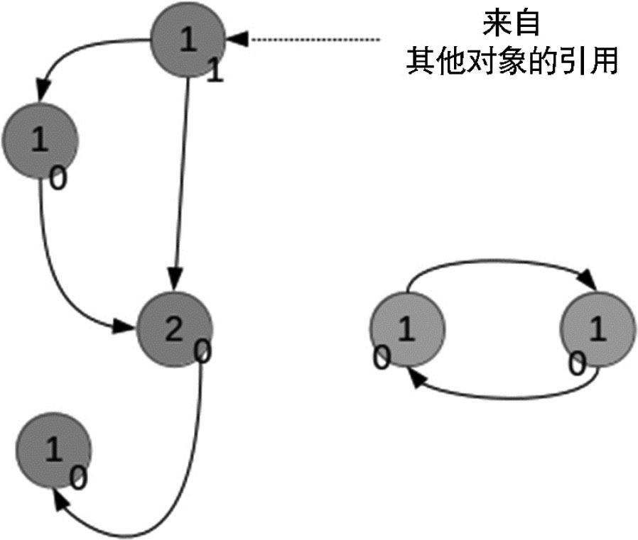

# 6.4 内存管理

### 1．引用管理

语言的内存管理是语言设计的一个重要方面，它是决定语言性能的重要因素。无论是C语言的手工管理，还是Java的垃圾回收，都成为语言最重要的特征。这里以Python语言为例，来说明一门动态类型的、面向对象的语言的内存管理方式。

首先我们要明确，对象内存管理是基于对引用的管理。我们已经提到，在Python中，引用与对象分离。一个对象可以有多个引用，而每个对象中都存有指向该对象的引用总数，即**引用计数**（Reference Count）。我们可以使用标准库中sys包中的getrefcount()，来查看某个对象的引用计数。需要注意的是，当使用某个引用作为参数，传递给getrefcount()时，参数实际上是创建了一个临时的引用。因此，getrefcount()所得到的结果，会比期望的多1：

------------------------------------------------------------------------

    from sys import getrefcount

    a = [1, 2, 3]
    print(getrefcount(a))

    b = a
    print(getrefcount(b))

------------------------------------------------------------------------

由于上述原因，两个getrefcount()将返回2和3，而不是期望的1和2。

### 2．对象引用对象

我们之前提到了一些可变对象，如列表和词典。它们都是数据容器对象，可以包含多个对象。实际上，容器对象中包含的并不是元素对象本身，而是指向各个元素对象的引用。我们也可以自定义一个对象，并引用其他对象：

------------------------------------------------------------------------

    class from_obj(object):
        def __init__(self, to_obj):
            self.to_obj = to_obj

    b = [1,2,3]
    a = from_obj(b)
    print(id(a.to_obj))
    print(id(b))

------------------------------------------------------------------------

可以看到，a引用了对象b。对象引用对象，在Python中十分常见。比如在主程序使用a
=
1，会把引用关系存入到一个词典中。该词典对象用于记录所有的全局引用。赋值a=1，实际上是让词典中一个键值为"a"的元素引用整数对象1。我们可以通过内置函数globals()来查看该词典。

当一个对象a被另一个对象b引用时，a的引用计数将增加1：

------------------------------------------------------------------------

    from sys import getrefcount

    a = [1, 2, 3]
    print(getrefcount(a))

    b = [a, a]
    print(getrefcount(a))

------------------------------------------------------------------------

由于对象b引用了两次a，因此a的引用计数增加了2。

容器对象的引用可能会构成很复杂的拓扑结构，如图6-1所示。我们可以用objgraph包[^(2)^](part0010.xhtml#ch2){#ch2-back}来绘制其引用关系，比如：

------------------------------------------------------------------------

    x = [1, 2, 3]
    y = [x, dict(key1=x)]
    z = [y, (x, y)]

    import objgraph
    objgraph.show_refs([z], filename="ref_topo.png") # 第二个参数说明了绘图文件的文件名

------------------------------------------------------------------------

图6-1 引用结构

两个对象可能相互引用，从而构成所谓的**引用环**（Reference Cycle）。

------------------------------------------------------------------------

    a = []
    b = [a]
    a.append(b)

------------------------------------------------------------------------

即便是单个对象，只需自己引用自己，也能构成引用环。

------------------------------------------------------------------------

    a = []
    a.append(a)
    print(getrefcount(a))

------------------------------------------------------------------------

引用环会给垃圾回收机制带来很大的麻烦，我们将在后面详细叙述这一点。

某个对象的引用计数可能减少。比如，可以使用del关键字删除某个引用：

------------------------------------------------------------------------

    from sys import getrefcount

    a = [1, 2, 3]
    b = a
    print(getrefcount(b))
    del a
    print(getrefcount(b))

------------------------------------------------------------------------

我们前面提到过，del也可以用于删除容器中的元素，比如：

------------------------------------------------------------------------

    a = [1,2,3]
    del a[0]
    print(a)

------------------------------------------------------------------------

如果某个引用指向对象a，那么当这个引用被重新定向到某个其他对象b时，对象a的引用计数将减少：

------------------------------------------------------------------------

    from sys import getrefcount

    a = [1, 2, 3]
    b = a
    print(getrefcount(b))
    a = 1
    print(getrefcount(b))

------------------------------------------------------------------------

### 3．垃圾回收

吃太多，总会变胖，Python也是如此。当Python中的对象越来越多时，它们将占据越来越大的内存。不过你不用太担心Python的体形，它会乖巧的在适当的时候“减肥”，启动垃圾回收（Garbage Collection），将没用的对象清除。许多语言中都有垃圾回收机制，比如Java和Ruby。尽管最终目的都是塑造苗条的体形，但不同语言的减肥方案有很大的差异。

原理上，当Python的某个对象的引用计数降为0，即没有任何引用指向该对象时，该对象就成为要被回收的垃圾了。比如某个新建对象，它被分配给某个引用，对象的引用计数变为1。如果引用被删除，对象的引用计数为0，那么该对象就可以被垃圾回收。比如下面的表：

------------------------------------------------------------------------

    a = [1, 2, 3]
    del a

------------------------------------------------------------------------

del a后，已经没有任何引用指向之前建立的\[1, 2, 3\]这个表了，即用户不可能通过任何方式接触或者动用这个对象。这个对象如果继续待在内存里，就成为不健康的脂肪。当垃圾回收启动时，Python扫描到这个引用计数为0的对象，就会将它所占据的内存清空。

然而，减肥是个昂贵而费力的事情。垃圾回收时，Python不能进行其他的任务。频繁的垃圾回收将大大降低Python的工作效率。如果内存中的对象不多，就没有必要频繁启动垃圾回收。所以，Python只会在特定条件下，自动启动垃圾回收。当Python运行时，会记录其中分配对象（Object Allocation）和取消分配对象（Object Deallocation）的次数。当两者的差值高于某个阈值时，垃圾回收才会启动。

我们可以通过gc模块的get\_threshold()方法，查看该阈值:

------------------------------------------------------------------------

    import gc
    print(gc.get_threshold())

------------------------------------------------------------------------

返回（700, 10, 10），后面的两个10是与分代回收相关的阈值，后文中会详细说明。700即垃圾回收启动的阈值。可以通过gc中的set\_threshold()方法重新设置。当然，我们也可以手动启动垃圾回收，即使用gc.collect()。

除了上面的基础回收方式外，Python同时还采用了**分代**（Generation）回收的策略。这一策略的基本假设是，存活时间越久的对象，越不可能在后面的程序中变成垃圾。我们的程序往往会产生大量的对象，许多对象很快产生和消失，但也有一些对象长期被使用。出于信任和效率，对于这样一些“长寿”对象，我们相信它们还有用处，所以减少在垃圾回收中扫描它们的频率。

Python将所有的对象分为0、1、2三代。所有的新建对象都是0代对象。当某一代对象经历过垃圾回收，依然存活，那么它就被归入下一代对象。垃圾回收启动时，一定会扫描所有的0代对象。如果0代经过一定次数垃圾回收，那么就启动对0代和1代的扫描清理。当1代也经历了一定次数的垃圾回收后，就会启动对0、1、2代的扫描，即对所有对象进行扫描。

这两个次数即上面get\_threshold()返回的（700, 10, 10）返回的两个10。也就是说，每10次0代垃圾回收，会配合1次1代的垃圾回收；而每10次1代的垃圾回收，才会有1次2代的垃圾回收。

同样可以用set\_threshold()来调整次数，比如对2代对象进行更频繁的扫描。

------------------------------------------------------------------------

    import gc
    gc.set_threshold(700, 10, 5)

------------------------------------------------------------------------

### 4．孤立的引用环

引用环的存在会给上面的垃圾回收机制带来很大的困难。这些引用环可能构成无法使用，但引用计数不为0的一些对象：

------------------------------------------------------------------------

    a = []
    b = [a]
    a.append(b)
    del a
    del b

------------------------------------------------------------------------

上面我们先创建了两个表对象，并引用对方，构成一个引用环。删除了a、b引用之后，这两个对象不可能再从程序中调用，因而就没有什么用处了。但是由于引用环的存在，这两个对象的引用计数都没有降到0，所以不会被垃圾回收，如图6-2所示。

图6-2　孤立的引用环

为了回收这样的引用环，Python会复制每个对象的引用计数，可以记为gc\_ref。假设，每个对象i，该计数为gc\_ref\_i。Python会遍历所有的对象i。对于每个对象i所引用的对象j，将相应的gc\_ref\_j减1，遍历后的结果如图6-3所示。

图6-3　遍历后的结果

在结束遍历后，gc\_ref不为0的对象，和这些对象引用的对象，以及继续更下游引用的对象，需要被保留，而其他对象则被垃圾回收。

Python作为一种动态类型的语言，其对象和引用分离。这与曾经的面向过程语言有很大的区别。为了有效地释放内存，Python内置了垃圾回收的支持。Python采取了一种相对简单的垃圾回收机制，即引用计数，并因此需要解决孤立引用环的问题。Python与其他语言既有共通性，又有特别的地方。对内存管理机制的理解，是提高Python性能的重要一步。

————————————————————

[(1)](part0010.xhtml#ch1-back){#ch1} Python中还有一个\_\_getattribute\_\_()特殊方法，用于查询任意属性。

[(2)](part0010.xhtml#ch2-back){#ch2} objgraph是Python的一个第三方包，可以使用pip安装。
